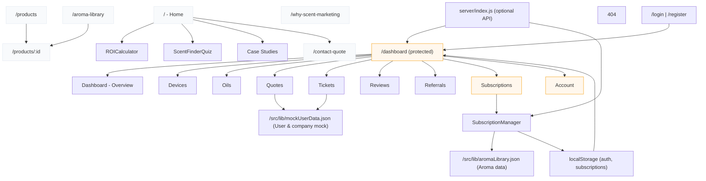
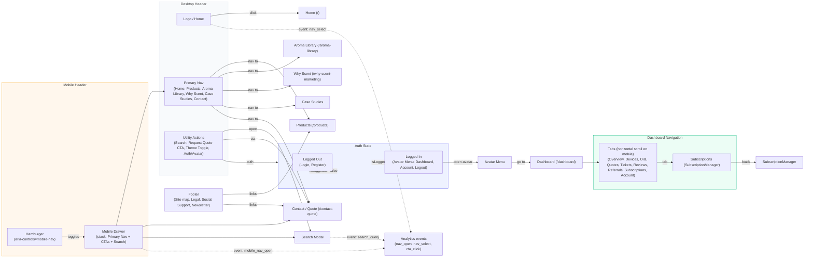

# Site Map & Technical Overview

This document provides a detailed site map, page/component mapping, data models, auth and routing notes, UX/responsive considerations, testing suggestions, and a Mermaid diagram visualizing relationships between pages and main features for the Breathe / EZE AirCare site.

## Purpose
- Give developers and product stakeholders a single reference for site structure, routing, and major components.
- Help plan navigation, SEO, and integration points (APIs / local state / storage).
- Provide a Mermaid script to render an architectural site map diagram.

---

## Quick index
- Pages & routes
- Component mapping
- Data models
- Navigation and auth rules
- Subsystems (subscriptions, quotes, support)
- Mobile / responsive notes
- Performance & SEO
- Tests to add
- Mermaid diagram (below)

---

## Pages & Routes
The site is a SPA implemented in React + Vite with React Router. Below are the main application routes and short descriptions.

- `/` (Index / Home)
  - Hero, Industry metrics, benefits, case studies, ROI calculator, Scent Finder Quiz, CTA
  - Public
- `/products`
  - Listing of product lines and links to product detail pages
  - Public
- `/products/:id` (ProductDetail)
  - Product detail page with images and descriptions
  - Public
- `/aroma-library`
  - Grid/list of available aroma oils (from `src/lib/aromaLibrary.json`)
  - Public
- `/why-scent-marketing`
  - Marketing content and case studies
  - Public
- `/contact-quote`
  - Contact / Quote request form (creates quote requests saved in local mock or server)
  - Public
- `/login` and `/register`
  - Authentication UI and flows (localStorage used in mock `AuthProvider`)
- `/dashboard` or `/user` (UserDashboard)
  - Protected route (requires authenticated user)
  - Tabs: Overview, Devices, Oils, Quotes, Tickets, Reviews, Referrals, Subscriptions, Account
  - Sub-pages are implemented as Tabs within the dashboard layout (not always separate route paths)
- `/dashboard/subscriptions` (Subscriptions tab)
  - SubscriptionManager component provides month selection, aroma selection per month, bulk apply, cost summary
- `404` (NotFound)

Notes:
- Many pages are not separate physical routes in code but are rendered as tab views; convert heavy sub-features into dedicated routes if deep-linking is required.

---

## Component -> Page mapping (high level)
These are the primary components in `src/components` and where they're used.

- `HeroSection` — Home
- `ROICalculator` — Home & can be re-used in marketing pages
- `ScentFinderQuiz` — Home
- `Navigation` — site header on all pages
- `ThemeProvider` — app-level provider
- `SubscriptionManager` — UserDashboard (Subscriptions tab)
- `Chatbot` — site-wide (if enabled)
- `AnimatedSection`, `DynamicCounter`, `ScrollProgress`, `ThemeToggle` — used across marketing pages
- `ui/*` — primitives and Radix wrappers used across components (Tabs, Select, Button, Card, etc.)

Detailed mapping (example):
- `UserDashboard` (src/pages/UserDashboard.tsx)
  - Header: Avatar, Company meta, Account buttons
  - Tabs: `Tabs`, `TabsList`, `TabsTrigger`, `TabsContent`
  - Subcomponents: `SubscriptionManager` (Subscriptions tab), many dialogs (quotes, tickets, referrals)

---

## Data models (shape examples)
These models are inferred from mock data (`src/lib/mockUserData.json`) and `aromaLibrary.json`.

- User
  - id, name, email, role, avatar, phone, settings
- Company
  - id, name, outlets[], since, totalOutlets, businessType
- Outlet
  - id, name, location, size
# Complete Site Map & Technical Overview

This document is the canonical site map and technical reference for the Breathe / EZE AirCare frontend. It combines route-level mapping, component ownership, data shape contracts, navigation UI specifications, accessibility and SEO guidance, recommended API contracts, CI/testing guidance, and visual diagrams (Mermaid).

Version: 1.1
Generated: 2025-10-04

Table of contents
- Overview
- Pages & Routes (full)
- Navigation UI details (header / mobile / dashboard)
- Component -> Page mapping
- Data models & validation
- SubscriptionManager: UI contract & data flow
- Suggested API endpoints (server contract)
- Accessibility checklist
- SEO & sitemap.xml guidance
- CI / Tests / Quality gates
- Performance & asset guidance
- Diagrams (Mermaid)
- How to use this file & next steps

---

## Overview
This app is a Vite + React + TypeScript single-page application that serves marketing pages and a protected user dashboard. The frontend uses a set of UI primitives (Radix wrappers) in `src/components/ui` and isolated components for pages in `src/pages` and `src/components`.

Goals for this document:
- Provide an authoritative route map and component ownership.
- Define the contract for critical flows (auth, subscriptions, quotes, tickets).
- Document navigation UI and accessibility behavior for desktop and mobile.
- Provide diagrams and next steps for production hardening.

---

## Pages & Routes (full)
Each route lists: path, permitted auth level, primary components, and notes for deep-linking / SEO.

- `/` — Home (public)
  - Components: `HeroSection`, `ROICalculator`, `ScentFinderQuiz`, `AnimatedSection`, `CaseStudies` (mapped in Index.tsx)
  - Notes: Important SEO landing page. Consider prerendering or SSR for meta tags.

- `/products` — Product listing (public)
  - Components: ProductList, ProductCard

- `/products/:id` — Product detail (public)
  - Components: ProductDetail
  - Notes: Provide canonical and open graph metadata for each product.

- `/aroma-library` — Aroma list (public)
  - Components: AromaGrid (reads `src/lib/aromaLibrary.json`)
  - Notes: Ensure `id` uniqueness in `aromaLibrary.json`.

- `/why-scent-marketing` — Marketing / Why Scent (public)

- `/contact-quote` — Contact or Request Quote (public)
  - Components: QuoteForm (creates a Quote record)

- `/login` & `/register` — Authentication (public)
  - Components: LoginForm, RegisterForm (Auth handled via `AuthProvider` mock)

- `/dashboard/*` — User Dashboard (protected)
  - Entry: `UserDashboard.tsx` (protected with `ProtectedRoute` wrapper)
  - Tabs: Overview, Devices, Oils, Quotes, Tickets, Reviews, Referrals, Subscriptions, Account
  - Deep-linking: recommend mapping specific tabs to child routes or query param, e.g. `/dashboard/subscriptions` or `/dashboard?tab=subscriptions` for shareable links.

- `/dashboard/subscriptions` — Subscriptions (protected)
  - Component: `SubscriptionManager` (monthly selection, aroma per month, bulk apply, save/cancel)

- `/*` — NotFound (public)

---

## Navigation UI details (header / mobile / dashboard)
See the full `Navigation UI details` expansion below (was previously added). Key points summarized:

- Desktop header: logo, primary nav (Home, Products, Aroma Library, Why Scent, Case Studies, Contact), utility actions (search, theme, CTA, login/avatar).
- Mobile: hamburger toggles off-canvas drawer containing stacked nav + CTAs + search. Use `aria-expanded` and `aria-hidden` appropriately.
- Dashboard Tabs: horizontally scrollable on mobile (`overflow-x-auto`) and `flex-shrink-0` on triggers to prevent overlap.
- Avatar menu and auth states: Logged-out shows Login/Register; Logged-in shows Avatar menu (Dashboard, Account, Logout).
- Accessibility: keyboard support for menus, `aria-current` for active nav, visible focus rings, semantic markup.

See the "Navigation Flowchart (Mermaid)" in the Diagram section.

---

## Component -> Page mapping
This is a more detailed mapping of key components and who owns them (file paths):

- `src/pages/Index.tsx` (Home)
  - `HeroSection` (`src/components/HeroSection.tsx`)
  - `ROICalculator` (`src/components/ROICalculator.tsx`)
  - `ScentFinderQuiz` (`src/components/ScentFinderQuiz.tsx`)

- `src/pages/Products.tsx`
  - `ProductList`, `ProductCard`

- `src/pages/ProductDetail.tsx`
  - `ProductDetail`

- `src/pages/Index.tsx` (benefits, case studies) — uses `AnimatedSection`, `DynamicCounter`

- `src/pages/UserDashboard.tsx` (Protected)
  - `SubscriptionManager` (`src/components/SubscriptionManager.tsx`)
  - Dialogs: Quote, Ticket, Referral, Account Settings

- UI primitives
  - `src/components/ui/tabs.tsx`, `select.tsx`, `dialog.tsx`, `button.tsx`, etc.

Ownership notes: When adding or changing a page, update this mapping and add a short comment at the top of changed files referencing the mapping.

---

## Data models & validation
Canonical shapes used across the app. Keep these in sync with server contracts.

- Aroma (AromaLibrary entry)
  - id: string (unique) — required
  - name: string
  - brand?: string
  - family?: string
  - sector?: string
  - price?: number
  - description?: string
  - image?: string / path

- User
  - id: string
  - name: string
  - email: string
  - role: string
  - avatar?: string

- Company
  - id: string
  - name: string
  - outlets: Outlet[]

- Outlet
  - id: string
  - name: string
  - location?: string
  - size?: string

- Subscription (client model)
  - id: string
  - userId: string
  - startMonth: string (YYYY-MM)
  - months: { id: 'YYYY-MM', aromaId: string | null }[]
  - totalCost: number

Validation rules
- `aroma.id` must be unique. Add a dev-time script (below) to validate.
- All currency values should be integers in paise or standardized cents to avoid floating rounding errors.

Validation script idea (node): iterate `aromaLibrary.json`, ensure no duplicate `id` and all required fields exist. Add to `package.json` as `npm run validate-data`.

---

## SubscriptionManager: UI contract & data flow
Contract (inputs / outputs / states):

- Inputs: initial subscription object or defaults (startMonth, monthsCount, saved months array), aromaOptions (from aromaLibrary.json)
- Outputs: onSave(subscription) -> persist to server/localStorage; onCancel() -> discard local changes
- UI state: selected start month, computed months array, each month's aromaId (nullable), bulk selection range, temporary cost computation

Edge cases to cover:
- startMonth at year boundary (Dec -> Jan next year)
- monthsCount = 0 (no subscription)
- aromaOptions contains duplicates (should be deduplicated in UI if data cannot be changed upstream)
- Select control: Radix Select requires each SelectItem `value` to be non-empty. Use `SelectValue` placeholder for empty state and a separate Clear action if needed.

Calculation helpers
- generateMonths(startMonth: string, count: number) => [{id, label, aromaId}]
- calculateTotal(months) => number
- calculateMonthlyAverage(total, count) => number

Persistence
- Initially: localStorage key `subscriptions:{userId}`
- Recommended: POST /api/users/:userId/subscriptions (see Suggested API endpoints)

---

## Suggested API endpoints (server contract)
These endpoints are suggestions if you replace the mock server/localStorage with a real backend.

- POST /api/auth/login { email, password } -> { token, user }
- POST /api/auth/register { name, email, password } -> { token, user }
- GET /api/aromas -> [Aroma]
- GET /api/products -> [Product]
- GET /api/users/:userId/subscriptions -> [Subscription]
- POST /api/users/:userId/subscriptions { subscription } -> { success, subscription }
- PUT /api/users/:userId/subscriptions/:subscriptionId { subscription }
- POST /api/quotes { quote } -> { id, status }
- POST /api/tickets { ticket } -> { id, status }

Security notes
- Protect endpoints with auth tokens (JWT/Bearer). The `server/index.js` in this repo is a local dev stub; remove or secure it in production.

---

## Accessibility checklist
Use this checklist when implementing navigation and interactive components.

- All interactive controls reachable via Tab order.
- Clear visible focus indicator for keyboard users (tailwind `focus:ring` patterns).
- `aria-label` or visible labels for icon-only buttons (search, theme, mobile toggle).
- `role="navigation"` and `aria-label` on nav elements.
- Menus and drawers should handle `Esc` to close and trap focus when appropriate.
- Use semantic headings (h1-h6) in content pages; ensure only one `h1` per page.
- Test with a screen reader (NVDA/VoiceOver) for major flows: login, create quote, open dashboard, subscriptions tab.

---

## SEO & sitemap.xml guidance
- Generate `sitemap.xml` during build for all public routes (Home, Products, Product Detail pages, Aroma Library, Marketing pages).
- Ensure each page has unique meta title and description; include Open Graph tags for social preview.
- For product detail pages, include structured data (JSON-LD) for product info where applicable.

Sample `sitemap.xml` generation flow:
- During build, read static routes and product IDs; write `public/sitemap.xml` with <urlset> entries.

---

## CI / Tests / Quality gates
Suggested pipeline (GitHub Actions or similar):

- Steps:
  1. checkout
  2. install (npm ci)
  3. run `npm run validate-data` (checks aroma ids uniqueness)
  4. run `npm run lint` (eslint)
  5. run `npm run test` (unit + component tests)
  6. build (npm run build)

Fail the pipeline on data validation, lint errors, or failing tests.

---

## Performance & asset guidance
- Keep hero and product images in `public/` with responsive `srcset` and modern formats (AVIF/WebP).
- Lazy-load noncritical components (chatbot, large carousels) with dynamic import.
- Use Vite's code splitting — set larger components as route-level chunks.

---

## Diagrams (Mermaid)
Below are two Mermaid diagrams: a site map and a navigation flowchart. Paste either block into a Mermaid-enabled viewer to render.

### Site map (high-level)


### Navigation Flowchart (detailed)


---

## How to use this file & next steps
- Use as the primary spec for navigation and route ownership.
- Copy the Mermaid blocks into `README.md` or design docs for visualization.
- Next recommended actions:
  1. Add `npm run validate-data` script to check `aromaLibrary.json` for duplicate ids.
  2. Implement a small `Header` component (accessible) and a `MobileDrawer` that follows the UI contract in this doc.
  3. Convert dashboard tabs to route-per-tab if deep-linking is required.
  4. Add CI step to run data validation and tests.

If you'd like, I can implement items 1 and 2 (validation script + Header component) next — tell me which to prioritize.

```

---

## How to use this file
- Share with designers and PMs to confirm structure and flows.
- Use the Mermaid block in documentation or README to show site navigation quickly.
- If you want, I can split the Mermaid diagram into multiple diagrams (marketing, dashboard, data flows) or export a PNG/SVG.

  ServerAPI["server/index.js (optional API)"]

## Next steps I can help with
- Generate a Graphviz or PNG export of the diagram.
- Create per-page wireframes (simple HTML scaffold) or route-level scaffolding.
- Create CI validation that `aromaLibrary.json` has unique IDs.
- Convert dashboard tabs to route-per-tab for deep-linking.


---
Generated: 2025-09-25
Generated: 2025-10-04
